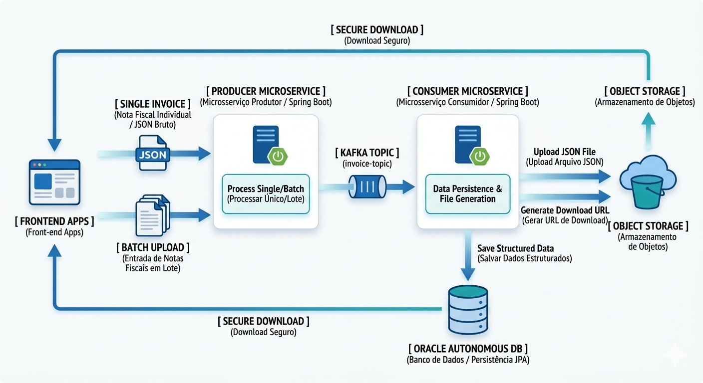

🌐 **[Read this documentation in Portuguese / Leia em Português](./README.pt-br.md)**

---

# 🚀 OCI Cloud Invoice Ingestion Platform

> Enterprise high-performance platform for invoice ingestion, asynchronous processing, and data governance built with Spring Boot, Apache Kafka, and Oracle Cloud Infrastructure (OCI).

---

### 👤 About Me
*   📄 **[Click here to download my Resume in PDF](./assets/curriculo.pdf)**
*   💼 **[Click here to download my Portfolio in PDF](./assets/portfolio-carlos-engenheiro-software.pdf)**
*   🌐 **[Connect with me on LinkedIn](https://linkedin.com/in/wellington-lopes-8b4bb4282)** 
*   🌐 **<a href="https://linkedin.com/in/wellington-lopes-8b4bb4282" target="_blank">Connect with me on LinkedIn</a>**
---

## 🗺️ Topology and Architecture Flow

 


[](https://openjdk.org)
[](https://spring.io)
[](https://apache.org)
[](https://oracle.com)
[](https://k3s.io)


### ⚙️ Core Features and Data Governance
*   🔄 **State Hydration / Monitoring**: Automated UI-to-database synchronization via an asynchronous REST API upon page load, preventing state loss during screen refreshes (F5).
*   🗑️ **Hybrid Atomic Purge (Cascading Delete)**: A transactional deletion workflow that wipes records from the relational database and synchronously purges the corresponding physical file from the Oracle Cloud Bucket (OCI Object Storage).
*   🛡️ **Interactive Visual Security**: A custom Dark Mode modal featuring a background blur effect for critical infrastructure confirmations, mitigating accidental batch deletions.

---

## 🏗️ Architecture and Software Engineering

The logical design of the data ecosystem is split into specialized, decoupled components:

*   **Producer Microservice (`invoice-producer`)**:
    *   **Entry Point (Edge Service)**: Acts as the API Gateway, exposed on port `8081`.
    *   **Flexible Ingestion**: REST Controllers equipped for high-throughput loads via **Raw Individual JSON** (`/single`) or asynchronous processing of **Batch Lists** (`/batch`).
    *   **Pragmatic Approach**: Performance-driven design using well-defined, native DTOs, avoiding unnecessary external tools codegen overhead during this controlled-scope phase.
*   **Consumer Microservice (`invoice-consumer`)**:
    *   **Pure Asynchronous Worker**: Optimized initialization disabling the web server (`spring.main.web-application-type=none`) to bypass Tomcat overhead and reduce RAM consumption.
    *   **Anti-Poison Pill Strategy**: Raw `String` consumption paired with manual Jackson Object Mapper deserialization inside a protective `try-catch` block, safeguarding the microservice against corrupted queue messages.
*   **Kafdrop (Web UI for Apache Kafka)**:
    *   **Messaging Observability**: Deployed locally on port `9000` for visual topic auditing and tracking the `faturamento-group` consumption lag.
*   **Rancher (Kubernetes Governance)**:
    *   **Centralized Orchestration**: Control center used exclusively in the cloud environment (OCI) to manage the lifecycle of Pods and nodes within the production K3s cluster.    
*   **Advanced Persistence (JPA / Hibernate)**:
    *   Powered by **Spring Data JPA** encapsulating the **Hibernate** engine.
    *   Business layer (`@Service`) secured with `@Transactional` boundaries (Ensuring ACID properties).
*   **Invoice Frontend (Client Layer)**:
    *   **Technologies**: HTML5, Vanilla JavaScript (ES6+), Tailwind CSS (Offline Integrated Style Guide), and JSZip.
    *   **Ecosystem Role**: Provides the operational dashboard for triggering invoice loads and monitoring asynchronous audits, while handling file compression and direct cloud streaming downloads.
    

---

## 📨 Messaging and Resilience (Apache Kafka)

The complete decoupling between invoice reception and physical database persistence is fully managed by events:
*   **Earliest Consumption Strategy**: Configured via `auto-offset-reset=earliest` tied to the `faturamento-group`. 
*   **Fault Tolerance**: If the consumer microservice goes down or undergoes maintenance, invoices are safely retained inside the durable Docker message broker and processed sequentially as soon as the worker recovers, preventing any data loss.


---

## 💻 Hybrid Development Environment (IntelliJ + WSL2)

To emulate production-like conditions locally, the ecosystem utilizes:
* **Isolated Containers**: Apache Kafka and Zookeeper orchestrated via Docker Compose, running natively inside the Linux Kernel of **WSL2 (Ubuntu)**.
* **Internal Network Routing**: IntelliJ (Windows environment) communicates directly with the Linux ecosystem through the `localhost:9092` loopback port.
* **Enterprise Security (Zero-Trust)**: No credentials or secret keys are stored in the `application.properties` files. All sensitive passwords are injected at runtime via JVM Environment Variables.

---

## ☁️ Cloud Infrastructure and DevOps (OCI + Kubernetes)

The application infrastructure leverages advanced resources from **Oracle Cloud Infrastructure (OCI)**:
* **Automation Scripts (OCI CLI)**: Creation of a CLI-based automated bot that monitored and provisioned **3 ARM Ampere compute instances** within the Always Free tier, overcoming cloud resource scarcity.
* **High Availability Kubernetes Cluster (K3s)**: Real orchestration using K3s distributed across the 3 instances. K3s was chosen to guarantee a lightweight control plane for the ARM architecture while maintaining full command support via **Kubectl**.
* **Automated Failover**: The cluster is configured so that if a node suffers a hardware failure, the other nodes automatically take over the application replicas.
* **Mandatory mTLS Security**: The **Oracle Autonomous Database** requires end-to-end mTLS encryption. The Java connection is authenticated through a **physical SSL certificate Wallet** integrated via native Java security drivers (`oraclepki`, `osdt_core`, `osdt_cert`).

---

## 🚀 How to Run the Infrastructure and Microservices

### 1. Prerequisites
*   Java 17 JDK installed on WSL2.
*   Docker and Docker Compose active on WSL2.
*   Oracle DB Wallet extracted into `/home/wcl/oracle_wallet`.

### 2. Initialize Messaging (WSL2 Terminal)
```bash
cd ~/portifolioNF
docker compose up -d
```
*   *Note: The **Kafdrop** web UI will be available immediately at `http://localhost:9000` to monitor the queues.*

### 3. Run the Producer Microservice
Open the `invoice-producer` project in IntelliJ and click the **Run / Play** button (Available on port `8081`).

### 4. Run the Consumer Microservice (WSL2 Terminal)
Navigate to the consumer root folder and run it by injecting the necessary environment variables to decrypt the Wallet and authenticate with the database:

```bash
cd ~/portifolioNF/invoice-consumer/invoice-consumer
./mvnw spring-boot:run -Dspring-boot.run.arguments="--spring.datasource.password='Estudos#OCI#2026' --oracle.net.wallet_password='Estudos#OCI#2026'"
```

### 5. Initialize the Frontend Control Panel
1. Open the `index.html` file located in the `invoice-frontend` folder using IntelliJ.
2. Use the built-in preview shortcut in the top right corner to open it in your preferred browser (Chrome/Edge).
3. Ensure that the microservices on ports `8081` (Producer) and `8082` (Web Consumer) are running so that ingestion and PAR link generation work perfectly.

### 6. Visual Message Auditing via Kafdrop
To ensure that the event flow is working and to inspect payloads at runtime:
1. Access `http://localhost:9000` in your browser to open the **Kafdrop** dashboard.
2. Click on the topic corresponding to the invoices (e.g., `faturamento-topic` or equivalent).
3. Click the **View Messages** button in the top right corner to list the records published by the producer and consumed by the worker.

---

## 🧪 API Test Contracts (Postman / cURL)

### Option 1: Via cURL (Directly in the Terminal)
Open a new terminal and run the command below to trigger a raw JSON test invoice:

```bash
curl -X POST http://localhost:8081/api/invoices/single \
  -H "Content-Type: application/json" \
  -d '{"numeroNota":"12345","cnpjEmitente":"12345678000199","cnpjDestinatario":"98765432000188","valorTotal":1500.50,"itens":"Item A, Item B"}'
```

### Option 2: Via Postman
* **Mapping**: `POST http://localhost:8081/api/invoices/single`
* **Payload (Body JSON)**:
```json
{
  "numeroNota": "77777",
  "cnpjEmitente": "12345678000199",
  "cnpjDestinatario": "98765432000188",
  "valorTotal": 3500.90,
  "itens": "Item A, Item B, Item C"
}
```
